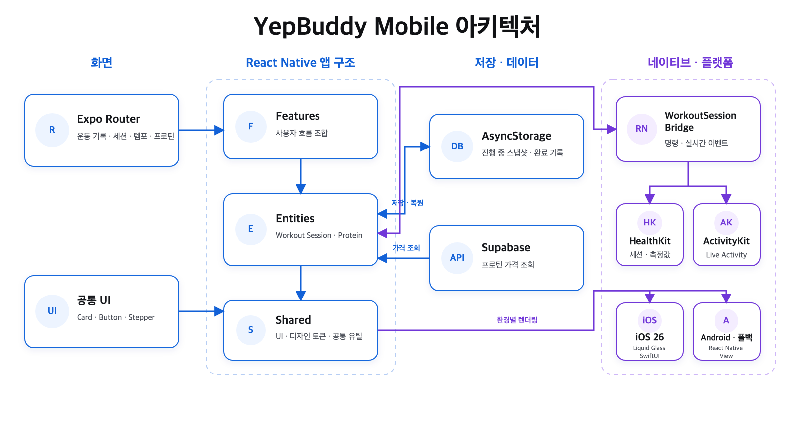
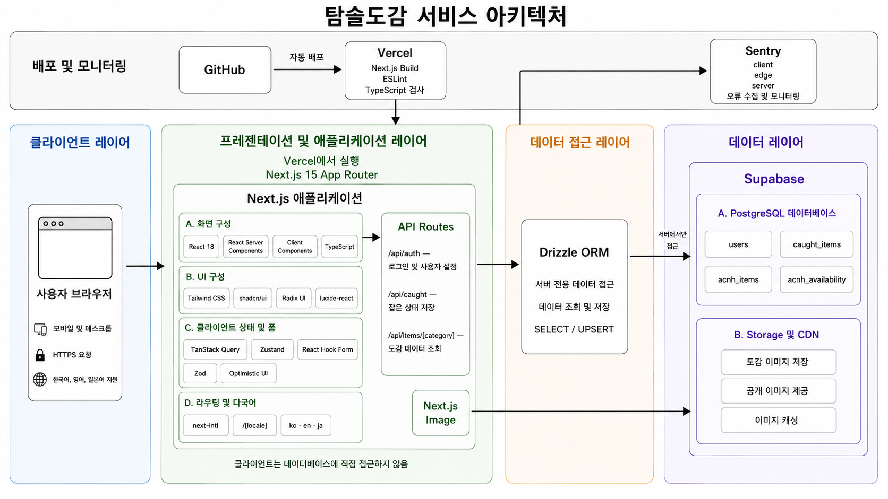
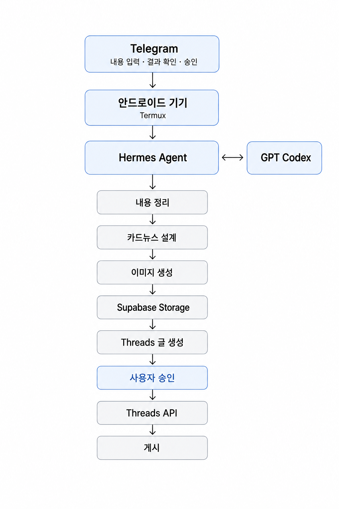
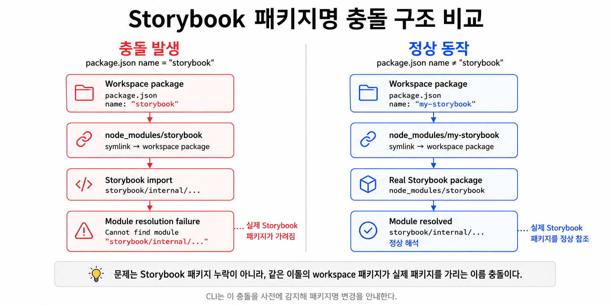
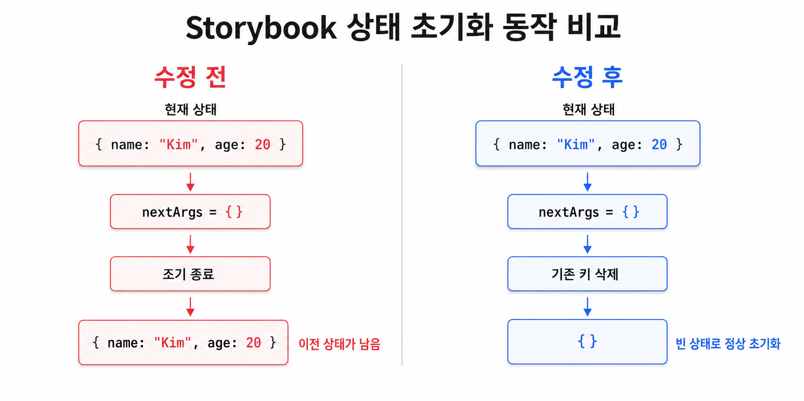

# Career

## 자연어 기반 백오피스 AI 커맨드 봇 구축

자연어 요청을 백오피스 기능 안내와 실제 작업 실행으로 연결한 사내 AI 도구

[포트폴리오 →](./career/ai-command/)

## 레거시 웹과 신규 웹의 공존을 위한 점진적 라우팅 전략 설계

운영 중인 레거시 웹 서비스를 중단하지 않고 신규 웹 서비스로 전환하기 위한 라우팅 구조 설계

[포트폴리오 →](./career/routing-branch/)

## GitHub Actions 기반 다국어 리소스 관리 자동화

번역 리소스 입력부터 JSON 반영과 PR 생성까지 연결한 자동화 워크플로우

[포트폴리오 →](./career/i18n-automation/)

# Side Projects

## 옙버디

운동 기록과 프로틴 가격 추적을 제공하는 React Native Expo 기반 iOS와 Android 피트니스 앱

[포트폴리오 →](https://github.com/whdjh/yepbuddy)

## 탐슬도감

모여봐요 동물의 숲 도감 데이터를 실시간 필터링하고 수집 현황을 관리하는 모바일 최적화 웹앱

[포트폴리오 →](https://github.com/whdjh/acnh)

## Hermes

Telegram 입력부터 카드뉴스 생성, 사용자 승인, Threads 게시까지 연결한 안드로이드 기반 개인 AI Agent 자동화 시스템

[포트폴리오 →](https://github.com/whdjh/yepbuddy-hermes)

# Open Source

## Storybook 워크스페이스 패키지명 충돌 사전 감지

워크스페이스 패키지명이 `storybook`일 때 발생하는 심볼릭 링크 충돌을 CLI에서 사전에 감지하도록 개선

[포트폴리오 →](./open-source/storybook-symlink/)

## Storybook Vue 3 args/globals 초기화 버그 수정

빈 객체를 적용해도 이전 `args`와 `globals`가 남던 Vue 3 렌더러의 상태 동기화 버그 수정

[포트폴리오 →](./open-source/storybook-state-reset/)
