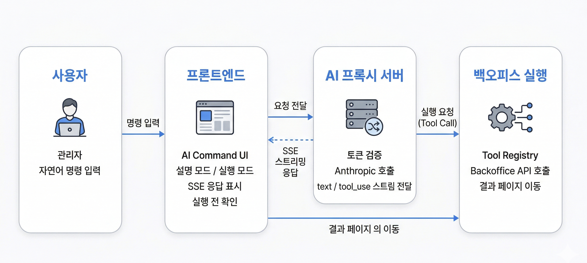
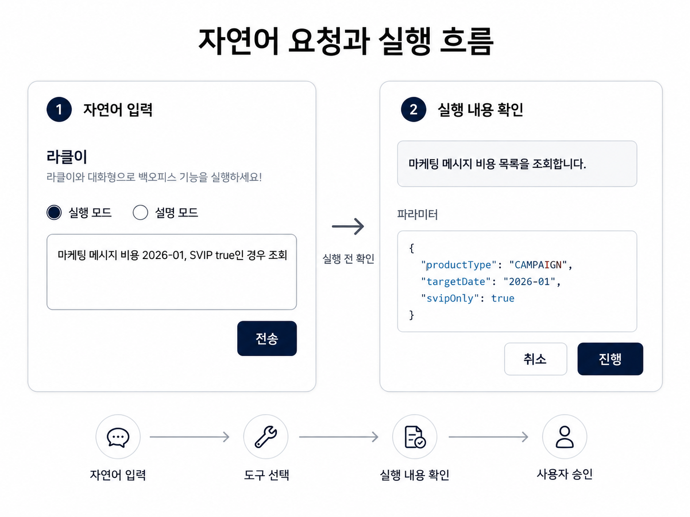
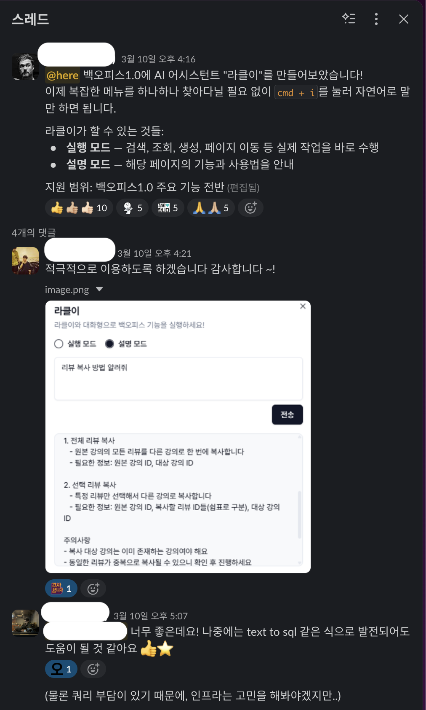

# 자연어 기반 백오피스 AI 커맨드 봇 구축

> **담당 범위**
> 문제 정의 · 기능 및 구조 설계 · 프론트엔드 개발 · AI Tool 설계 · 프록시 서버 구성 · 안전장치 구현

## 문제 상황

백오피스 기능이 여러 화면에 나뉘어 있어 신규 CX 인력이 필요한 기능을 찾기 어려웠고, **“이 작업을 하려면 어떻게 해야 하나요?”**라는 문의가 개발팀에 반복적으로 들어왔습니다.

CX 인력도 부족해 내부에서 사용법을 전달하는 데 시간이 걸렸고, 신규 인력이 업무에 익숙해지는 과정에서 같은 질문이 반복되는 상황이었습니다.

백오피스 개발 초반부터 프로젝트에 참여하며 각 도메인과 기능을 이해하고 있었기 때문에, 단순한 기능 안내를 넘어 **자연어 요청으로 필요한 기능을 찾고 실제 작업까지 실행할 수 있는 도구**를 목표로 설계했습니다.

---

## AI 커맨드 구조 설계

백오피스는 잘못된 작업이 실제 운영 데이터에 영향을 줄 수 있기 때문에, AI가 비즈니스 로직을 추측하거나 임의의 API를 선택하도록 두지 않았습니다.

실제 CX 요청에서 사용하는 회사 내부 용어를 기준으로 실행 가능한 기능과 API를 미리 매핑하고, 이를 Claude Function Calling의 Tool로 정의했습니다. 자연어 해석은 AI가 담당하지만 **실제로 선택하고 실행할 수 있는 작업은 사전에 정의된 Tool로 제한**했습니다.

예를 들어 특정 클래스에 강의를 추가하는 요청이라면 `클래스`, `강의`처럼 실제 업무에서 사용하는 용어가 어떤 기능과 연결되는지 미리 정의하고, Claude는 해당 명세 안에서 필요한 Tool과 입력값을 선택하도록 구성했습니다.

기능 설명에는 별도의 방식을 사용했습니다. 백오피스 개발 과정에서 개발자들의 도메인 지식과 Jira에 흩어져 있던 비즈니스 로직을 페이지별 README로 정리하고 있었기 때문에 이를 기능 안내에 활용했습니다.

사용 방법이나 비즈니스 로직을 묻는 요청은 페이지 가이드를 기반으로 설명하고, 실제 데이터 변경이 필요한 요청은 Tool을 선택하도록 **설명과 실행의 역할을 분리**했습니다. 이를 통해 AI가 문서에 있는 비즈니스 로직을 바탕으로 임의의 실행 방법을 만들어내지 않도록 했습니다.

---

## Tool 확장 구조

초기에는 약 3개의 도메인을 대상으로 각각 필요한 Tool을 직접 구현했습니다.

구현을 확장하면서 조회·생성·수정 기능 대부분이 **Tool 정의 → 입력값 전달 → 백오피스 API 호출 → 결과 처리**라는 공통 흐름을 갖는 것을 확인했습니다.

반복되는 CRUD 작업은 공통 실행 로직으로 분리하고, 새로운 기능을 추가할 때 필요한 설정값을 전달하는 방식으로 구조를 변경했습니다.

도메인마다 실행 코드를 새로 작성하는 대신 작업에 필요한 API와 입력 파라미터 등의 정보를 설정으로 추가하면 동일한 실행 흐름을 사용할 수 있도록 구성했습니다. 이를 통해 Tool 추가 방식이 개발자별 구현에 의존하지 않고 일정한 구조를 유지하도록 했습니다.

---

## 자연어 요청과 실행 흐름

CX가 Slack 등으로 전달받은 요청을 그대로 입력해도 실제 백오피스 작업으로 이어질 수 있도록 구성했습니다.

실행 요청이 들어오면 Claude는 사전에 정의된 Tool 가운데 요청에 맞는 작업을 선택하고 필요한 입력값을 구성합니다.

선택된 Tool은 바로 실행하지 않습니다. 프론트엔드에서 **어떤 작업을 어떤 값으로 실행할 것인지 먼저 보여주고**, 사용자가 확인한 경우에만 해당 Tool과 연결된 백오피스 API를 호출합니다.

작업이 끝난 뒤에는 결과를 전달하거나 필요한 백오피스 페이지로 이동하도록 구성했습니다.

**자연어 입력 → 정의된 Tool 선택 → 입력값 구성 → 실행 내용 확인 → 사용자 승인 → API 실행**

---

## 실행 안전성과 권한 검증

AI 기능이 실제 운영 데이터에 접근하는 만큼 편의성보다 실행 범위를 명확하게 제한하는 것을 우선했습니다.

프론트엔드에서 Claude API를 직접 호출하지 않고 별도의 프록시 서버를 통해 요청하도록 구성해 Claude API 키가 클라이언트에 노출되지 않도록 했습니다. 또한 요청 시 백오피스 액세스 토큰을 검증해 인증된 사용자만 AI 기능을 사용할 수 있도록 구성했습니다.

AI가 선택한 작업은 사용자 승인 전에는 실행되지 않으며, 삭제처럼 위험도가 높은 작업은 처음부터 Tool에 포함하지 않아 실행 대상에서 제외했습니다.

이를 통해 AI는 자연어를 해석하고 미리 정의된 작업을 선택하는 역할만 담당하고, **실제 실행 가능 범위와 최종 실행 여부는 시스템과 사용자가 통제**하도록 구성했습니다.

---

## 결과

CX가 자연어로 필요한 기능을 찾고 직접 작업할 수 있는 사내 도구로 배포했습니다.

사내 배포 후 CX 구성원으로부터 실제 업무에 활용하겠다는 반응을 확인했고, 자연어를 활용한 추가 기능으로 확장할 수 있다는 피드백도 받았습니다.

개발팀에 사용법을 다시 문의하지 않고도 필요한 기능을 탐색하거나 직접 실행할 수 있는 흐름을 마련했습니다.
