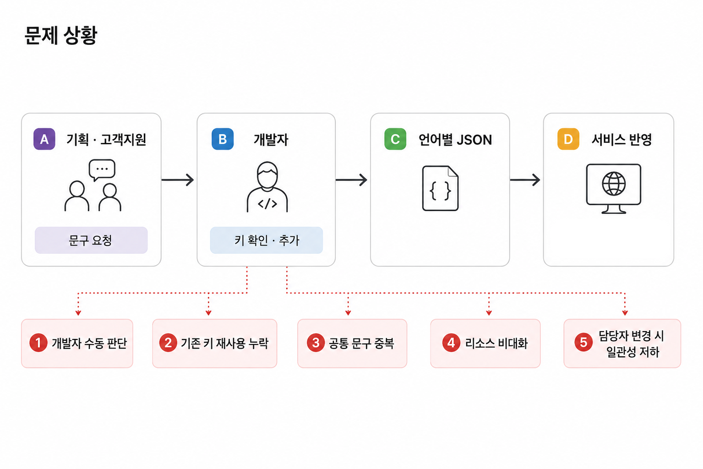
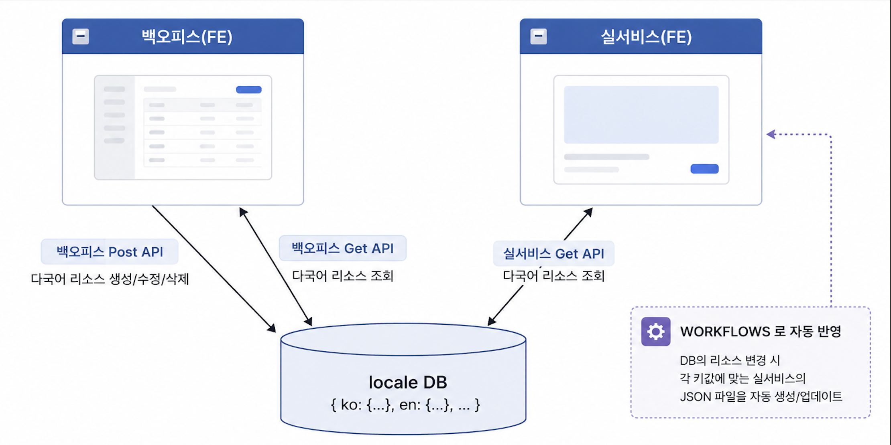
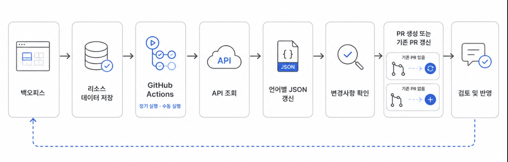
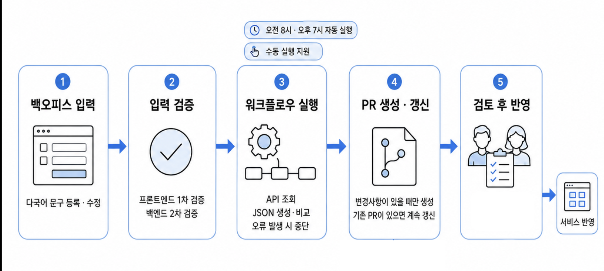

# GitHub Actions 기반 다국어 리소스 관리 자동화

> **담당 범위**
> 관리 방식 검토 · 백오피스 화면 개발 · 입력 검증 · GitHub Actions 자동화 설계 및 구현

## 문제 상황

PM이나 CX에서 필요한 다국어 문구를 전달하면 개발자가 기존 리소스를 확인하고 직접 반영하는 방식으로 관리하고 있었습니다.

화면이 변경되거나 담당자가 바뀔 때마다 기존 키를 다시 탐색하고 재사용 여부를 판단해야 했고, 이 과정에서 비슷한 공통 문구가 새로운 키로 추가되는 경우가 반복됐습니다.

당시 3개 언어를 지원하고 있었고 서비스 확장에 따라 지원 언어가 늘어날 가능성도 있어, 개발자의 수동 판단에 의존하는 관리 방식을 개선할 필요가 있다고 판단했습니다.

---

## 관리 방식 설계

백엔드에서는 Swagger API 명세를 기준으로 타입 파일을 자동 갱신하고 변경 내용을 PR로 확인하는 방식을 사용하고 있었습니다. 약 4개월간 안정적으로 운영되는 것을 확인하며 반복적인 전달과 확인 과정을 자동화하는 방식의 효과를 확인했고, 다국어 리소스에도 같은 방향을 적용했습니다.

| 방식            | 장점                         | 고려할 점          |
| ------------- | -------------------------- | -------------- |
| 백오피스          | 사내 서비스 활용, 무료, 검증 로직 구현 가능 | 초기 개발 필요       |
| Google Sheets | 익숙한 사용 방식, 무료              | 연동 스크립트 관리 필요  |
| Slackbot      | 접근이 간편함                    | 전체 리소스 관리가 어려움 |
| Notion DB     | 비개발자 사용이 편함                | 입력 검증이 제한적     |
| Inlang        | 다국어 관리에 특화                 | 외부 도구 의존성      |

사내에서 이미 운영 중인 서비스라 별도 비용이 없고, 다국어 키와 입력값에 필요한 검증 로직을 직접 적용할 수 있다는 점을 고려해 백오피스를 선택했습니다.

백오피스에서 입력한 다국어 리소스를 하나의 저장소에서 관리하고, 이를 기준으로 서비스의 언어별 JSON 파일을 갱신하는 구조로 설계했습니다.

---

## 자동화 흐름

백오피스에서 관리하는 다국어 리소스를 GitHub Actions가 API로 조회하고 언어별 JSON 파일을 자동으로 갱신하도록 구성했습니다.

워크플로우는 첫 출근 시간과 마지막 퇴근 시간을 기준으로 **오전 8시와 오후 7시에 자동 실행**되며, 필요한 경우 수동으로도 실행할 수 있도록 했습니다.

변경사항이 있으면 PR을 생성하고, 이미 열린 다국어 PR이 있다면 같은 PR을 갱신해 동일한 변경사항이 여러 PR로 분산되지 않도록 했습니다.

---

## 검증과 반영

자동화된 값이 바로 서비스에 반영되지 않도록 입력부터 반영까지 여러 단계의 검증을 두었습니다.

백오피스에서는 프론트엔드에서 입력값을 먼저 검증하고 오류를 안내했으며, 백엔드에서도 다시 검증하도록 구성했습니다. 워크플로우 실행 중 오류가 발생하면 작업을 중단하고, 생성된 PR은 개발자와 PM이 확인한 뒤 반영했습니다.

여러 도메인이 하나의 프로젝트에서 같은 다국어 리소스를 사용하기 때문에 변경사항은 여러 PR로 나누지 않고 하나의 PR에서 관리했습니다.

---

## 결과

자동화 적용 후 개발자가 언어별 JSON 파일을 직접 수정하는 과정을 제거했습니다.

기획과 고객지원은 백오피스에서 다국어 리소스를 관리하고, 개발자는 생성된 PR의 변경사항을 검토하는 구조로 역할을 분리했습니다.

담당 개발자가 변경되더라도 동일한 관리 흐름을 유지할 수 있었고, 다국어 변경을 위해 개발자에게 별도로 전달하고 확인하던 과정도 줄었습니다.