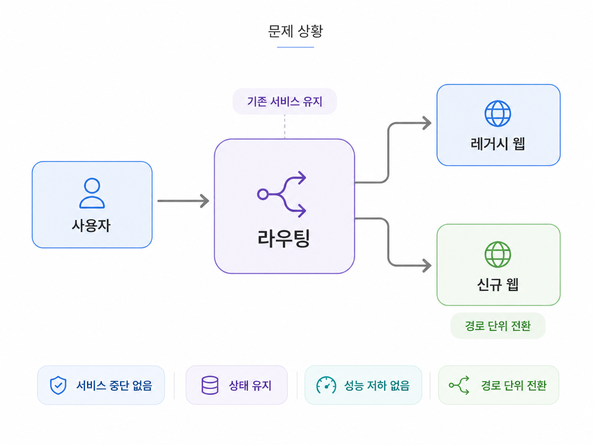
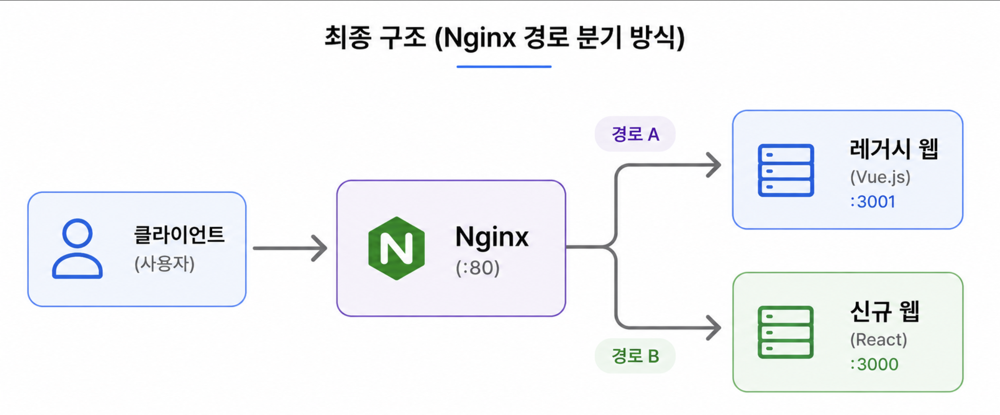

# 레거시 웹과 신규 웹의 공존을 위한 점진적 라우팅 전략 설계

> **담당 범위**
> 전환 방식 검토 · 개념 검증 설계 및 구현 · 전환 조건 검증 · 최종 라우팅 구조 제안

## 문제 상황

운영 중인 레거시 웹을 신규 웹으로 전환해야 했지만, 서비스 중단 없이 기존 서비스와 신규 서비스를 함께 운영해야 했습니다.

회의를 통해 전체 서비스를 한 번에 교체하는 대신 **경로 단위로 신규 웹을 점진적으로 적용하는 방향**이 결정됐고, 이를 실제 서비스에서 운영할 수 있는 라우팅 구조를 검토했습니다.

전환 과정에서도 기존 로그인 상태와 브라우저 저장 데이터가 유지되어야 했으며, 성능 저하나 별도 창을 사용하는 방식은 허용할 수 없는 조건이었습니다.

---

## 라우팅 방식 설계

서비스를 중단하지 않고 두 웹을 함께 운영할 수 있는 방법으로 여러 방식을 검토했습니다.

| 방식                | 장점                              | 고려할 점                     |
| ----------------- | ------------------------------- | ------------------------- |
| Iframe            | 기존 서비스 안에 신규 화면을 빠르게 포함 가능      | 운영과 사용자 경험 측면의 제약         |
| Module Federation | 기능 단위로 점진적인 전환 가능               | 두 프레임워크가 함께 로드되며 성능 부담 발생 |
| Nginx 경로 분기       | 두 서비스를 독립적으로 운영하면서 단일 도메인 유지 가능 | 라우팅 변경 시 인프라 설정에 의존       |
| 프론트엔드 경로 분기       | 프론트엔드에서 라우팅을 직접 관리 가능           | 신규 웹이 모든 요청의 진입점이 됨       |

초기 검토에서는 성능 부담 없이 두 서비스를 독립적으로 운영할 수 있는 Nginx 경로 분기가 가장 적합했습니다.

다만 라우팅 변경마다 인프라 설정에 의존해야 했기 때문에, 프론트엔드에서 경로를 직접 관리할 수 있는 방식도 추가로 검증했습니다.

---

## 전환 흐름 검증

프론트엔드 경로 분기 방식이 실제 전환 과정에서도 기존 동작을 유지할 수 있는지 검증했습니다.

| 검증 항목            | 결과        |
| ---------------- | --------- |
| 레거시 웹 ↔ 신규 웹 이동  | 정상        |
| 각 웹 내부 이동        | 정상        |
| 쿠키 및 브라우저 저장소 공유 | 정상        |
| 뒤로가기 및 새로고침      | 기본 동작 유지  |
| 입력값 및 스크롤        | 기존 동작과 동일 |

두 웹을 동일한 출처에서 제공해 쿠키와 브라우저 저장소를 별도의 동기화 과정 없이 공유할 수 있었습니다.

라우팅 구조 적용 전후의 이동과 화면 상태도 비교해 기존 동작에 영향을 주지 않는 것을 확인했습니다.

---

## 한계 확인과 최종 구조

프론트엔드 경로 분기 방식은 경로를 직접 관리할 수 있다는 장점이 있었지만, 추가 검증 과정에서 두 웹 사이의 응답과 정적 자산을 일관되게 처리하기 어려운 문제를 확인했습니다.

* 레거시 웹과 신규 웹의 HTTP 오류를 일관된 방식으로 처리하기 어려움
* 공통 오류 처리가 불가능해 에러 페이지와 오류 처리 로직을 각 웹에 중복 구현해야 함
* favicon과 같은 정적 자산도 요청 경로에 따라 정상적으로 전달되지 않음

| 방식          | 구조                            | 특징                                    |
| ----------- | ----------------------------- | ------------------------------------- |
| 프론트엔드 경로 분기 | 클라이언트 → 신규 웹 → 레거시 웹 또는 자체 처리 | 프론트엔드에서 경로를 관리할 수 있지만 모든 요청이 신규 웹을 거침 |
| Nginx 경로 분기 | 클라이언트 → Nginx → 레거시 웹 또는 신규 웹 | 각 웹을 독립적으로 유지하면서 요청을 경로에 따라 분리        |

추가 검증 결과, 오류와 정적 자산을 각 웹에서 독립적으로 처리할 수 있는 Nginx 경로 분기가 운영 환경에 더 적합하다고 판단했습니다.

---

## 결과

검증 결과를 바탕으로 **Nginx 경로 분기 방식**을 제안했고, 해당 구조가 신규 서비스의 점진적 전환 방식으로 적용됐습니다.

요청 경로를 기준으로 레거시 웹과 신규 웹을 분리해 각 서비스를 독립적으로 운영하면서도, 기존 서비스를 중단하지 않고 페이지 단위로 신규 웹을 순차적으로 적용할 수 있는 구조를 마련했습니다.
